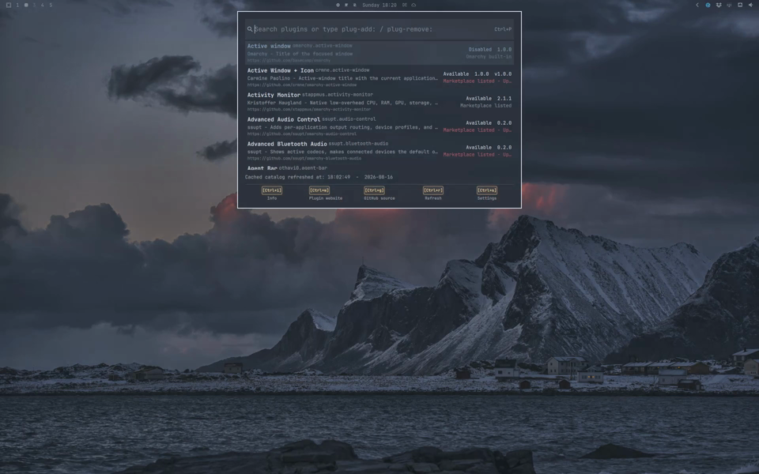
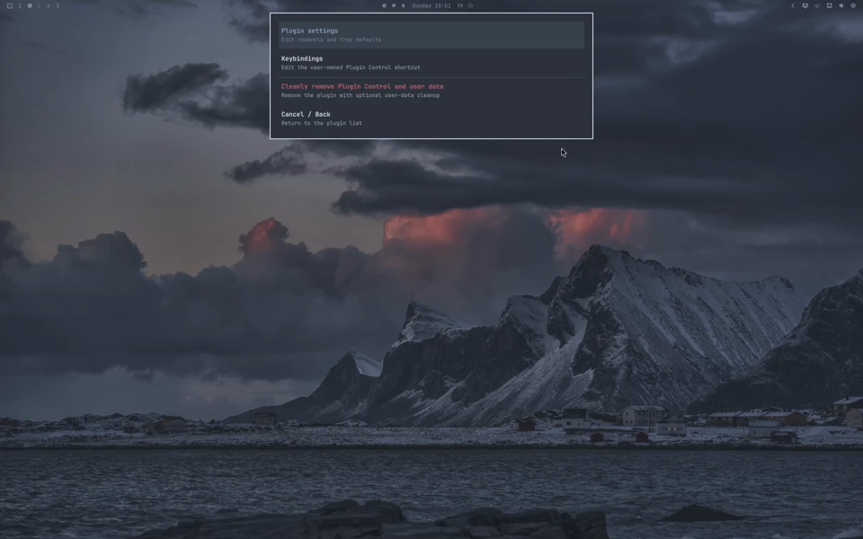

# Plugin Control

Think of Sublime Text's classic Package Control or the VS Code Command Palette,
but for Omarchy Quattro plugins.

Press Ctrl+p (or click the tray icon), type a few letters to fuzzy-search, and
press Enter to open one consistent action menu for that plugin.


Plugin Control keeps the full [@HANCORE-linux](https://github.com/HANCORE-linux)
[community marketplace](https://omarchyplugins.com/) and local plugin state in a
small cache, then filters it in process on every keypress. Startup reads only
that local cache. Press Ctrl+r when you want to refresh catalog and marketplace
metrics data from the configured sources.

## Install

```bash
omarchy plugin add https://github.com/ilyaZar/plugin-control.git --enable
```

Plugin manifests cannot add global bindings. For a keyboard-only path, add this
optional binding to your repo-managed or user-owned `bindings.lua`:

```lua
o.bind(
  "CTRL + P",
  "Plugin Control",
  "omarchy-shell shell toggle io.github.ilyazar.plugin-control '{}'"
)
```

Bare Ctrl+p is quick, but it replaces the usual application shortcut while the
binding is active. Change the first string if that disrupts your setup.

## Use

Start typing to search plugin names, IDs, descriptions, authors, and tags. Enter
opens the same action menu whether the plugin came from ordinary search or an
explicit command. Ctrl+i opens the same information read-only.

The menu reflects the selected plugin's current state:

- a built-in plugin offers Cancel and Enable or Disable
- an added user plugin offers Cancel, Update, Enable or Disable, and Remove
- an available user plugin offers Cancel and Add
- an active full bar offers only Cancel; an inactive full bar can be enabled

Enable and Disable are the UI terms for the native Omarchy operation. For a
built-in bar widget, that operation may add or remove its bar placement. Plugin
Control always delegates the change to `omarchy plugin enable` or
`omarchy plugin disable`.

Use these commands to narrow the action first:

- `plug-add:` shows plugins available through `omarchy plugin add`
- `plug-remove:` shows removable local plugins
- `plug-enable:` shows disabled switchable plugins
- `plug-disable:` shows enabled switchable plugins
- `plug-update:` checks first, then shows safely updateable plugins

Commands are not pinned. Type `add`, `remove`, `enable`, `disable`, or `update`
to bring one forward, then press Tab or Enter to complete it. Search restarts
after the colon. Completing `plug-update:` starts its read-only check. Backspace
edits a plugin name normally; at an empty completed prefix, one press removes
the trailing space and the next clears the command.

Ctrl+u is the direct update-check path. It enters `plug-update:`, fetches each
added Git plugin's upstream `HEAD`, and lists only safe fast-forward updates.
It never updates a plugin by itself. Select a result, choose Update, and Plugin
Control invokes the native command:

```bash
omarchy plugin update <plugin-id> --yes
```

Already-current plugins report `Plugin already up-to-date!` when Update is
chosen. Update remains visible but dimmed for manually copied plugins, dirty
checkouts, and ahead or diverged Git histories. Rest on the dimmed action for
one second, or activate it, to see the reason. A failed check keeps any safe
results that were found and preserves the last fully successful check time.

Useful keys:

| Keys                                 | Action                                  |
| ------------------------------------ | --------------------------------------- |
| `Ctrl+p` or `Escape`                 | Close from the plugin list              |
| `Up`, `Down`, `Page Up`, `Page Down` | Move the selection                      |
| `Home` or `End`                      | Jump to the first or last result        |
| `Enter`                              | Complete or confirm                     |
| `Tab`                                | Complete the selected command           |
| `Ctrl+Backspace`                     | Remove the previous word                |
| `Ctrl+u`                             | Check for updateable plugins            |
| `Ctrl+r`                             | Refresh catalog and metrics             |
| `Ctrl+i`                             | Show read-only plugin details           |
| `Ctrl+w`                             | Open the plugin website                 |
| `Ctrl+g`                             | Open the source repository              |
| `Ctrl+s`                             | Open settings; `Escape` returns         |

The status row keeps update and action feedback on the left and catalog
refresh feedback on the right. Running work is yellow, a successful result is
green for ten seconds, and settled timestamps are grey.

## Plugin information

Ctrl+i keeps the selected plugin strictly read-only and shows its complete,
untruncated description, author, version, source, repository, reviewed commit
when known, tags, and listing state. Marketplace-listed user plugins also show
stars, verification state, views, command copies, and anonymous hearts when
those values are cached. Verification describes marketplace checks associated
with the listed commit; it is not a security audit.

When the marketplace supplies a preview, the information view shows its card
image. Click the image to open the larger marketplace detail image. Enter,
Space, Escape, or q closes the full-size preview and the same keys close the
information view. Ctrl+i exposes no Add, install-in-terminal, or other system
action. Preview WebPs are downloaded only when requested and converted through
Omarchy's base ImageMagick package into a small plugin-owned PNG cache, because
the shell's Qt image loader does not include a WebP decoder.

The detail view follows the marketplace's visual language: yellow GitHub
stars, orange view and copy icons, a red-orange heart, and colored New,
Updated, Verified, and Unverified badges. New and Updated follow the same
twelve-hour window as the website, with Updated taking precedence.

Marketplace interaction totals are fetched once per explicit Ctrl+r refresh.
If that request fails, Plugin Control silently retains the last valid values
and retries on the next refresh. Missing totals remain unknown rather than
being displayed as zero.

## Demo

Click either preview to play the video.

<table>
  <tr>
    <td width="50%" valign="top">
      <a
        href="https://ilyazar.github.io/plugin-control/demo/video_plugin_control_add_remove_enable_disable.mp4"
      >
        
      </a>
      <p><strong>Add, remove, enable, and disable</strong></p>
      <p>
        Shows how quickly plugins can be added, removed, enabled, and disabled,
        using the
        <a href="https://github.com/ilyaZar/omarchy-btop-activity">btop plugin</a>
        as an example.
      </p>
    </td>
    <td width="50%" valign="top">
      <a
        href="https://ilyazar.github.io/plugin-control/demo/video_plugin_control_settings.mp4"
      >
        
      </a>
      <p><strong>Refresh and settings</strong></p>
      <p>
        Shows how to refresh the cached plugin catalog and use Plugin Control
        settings, including enabling or disabling the tray icon and performing
        a clean uninstall and reinstall of the plugin.
      </p>
    </td>
  </tr>
</table>

## Start and stop

These commands enable or disable Plugin Control itself. The tray options only
control whether its icon appears after the plugin starts:

```bash
~/.config/omarchy/plugins/io.github.ilyazar.plugin-control/bin/plugin-control start
~/.config/omarchy/plugins/io.github.ilyazar.plugin-control/bin/plugin-control start --tray-hidden
~/.config/omarchy/plugins/io.github.ilyazar.plugin-control/bin/plugin-control stop
```

The helper belongs to the installed plugin checkout and is not added to
`PATH`. Run it with the full path above, or from the checkout root as
`bin/plugin-control`.

`start` uses the configured tray default. `--tray-hidden` and `--tray-visible`
override it. `stop` disables the whole plugin, not only its tray icon.

## Settings

Ctrl+s opens Plugin settings, Keybindings, clean removal, and Cancel / Back.
Use `j`/`k`, arrows, mouse, or Enter; Escape returns to the plugin list.

```text
~/.config/omarchy/ilyazar.plugin-control/channels.yaml
~/.config/hypr/bindings.lua
```

```yaml
settings:
  tray-icon-hidden: false
```

Plugin Control never rewrites the user-owned Ctrl+p binding. Its other shortcuts
work only while the palette is focused. Saving a valid tray setting updates the
live bar; a CLI flag overrides it until the YAML is saved again.

Settings use strict schema 2. A rejected field produces a short notification
with its value and admissible type or range. The plugin keeps the last valid
settings, or uses shipped defaults when a recoverable first-run typo has no
last-valid file. It never rewrites the invalid YAML. Version 1 is not migrated.

## Dependencies

- Omarchy Quattro and its shell
- Bash, curl, Git, and jq
- Ruby with Psych
- util-linux (`flock` and `setsid`)
- GNU coreutils (`timeout`)
- `omarchy-launch-terminal` for terminal adds

Plugin Control installs no packages and requests no elevated privileges.

## Remove

Select Plugin Control under `plug-remove:` for native removal, or open Settings
and select Cleanly remove Plugin Control and user data. The confirmation offers
three choices:

- Yes (preserve user data) uses native removal
- Yes (delete user data) removes namespaced state and the recognized Plugin
  Control keybinding before native removal
- No / abort makes no changes

The native command is:

```bash
omarchy plugin remove io.github.ilyazar.plugin-control
```

Native removal keeps:

- settings: `~/.config/omarchy/ilyazar.plugin-control/`
- cache: `~/.cache/omarchy/ilyazar.plugin-control/`
- action history: `~/.local/state/omarchy/ilyazar.plugin-control/`

Clean removal deletes the current author-namespaced paths.

## Development

```bash
tests/all.sh
shellcheck bin/plugin-control scripts/*.sh tests/*.sh
omarchy plugin validate .
```

## Marketplace design credit

The detail view follows the icon language, activity rules, and semantic colors
of HANCORE's MIT-licensed
[Omarchy Plugin Marketplace](https://github.com/HANCORE-linux/omarchy-plugin-marketplace).
It uses Omarchy's installed Nerd Font rather than bundling the website font.

## License

MIT. See [LICENSE](LICENSE).
