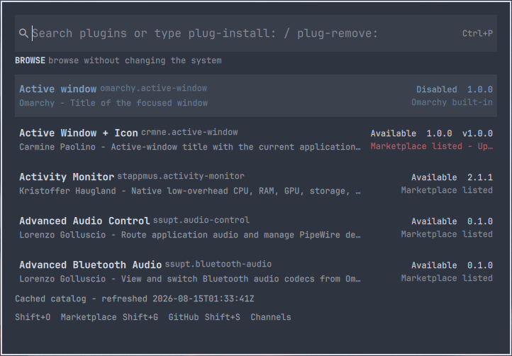

# Plugin Control



Think of Sublime Text's classic Package Control or the VS Code Command
Palette, but for Omarchy Quattro plugins. Press Ctrl+P, type a few letters,
and install or remove a plugin without leaving the keyboard.

Plugin Control keeps the full HANCORE marketplace and local plugin state in a
small cache, then filters it in process on every keypress. Opening the palette
does not start network or Git work.

## Install

```bash
omarchy plugin add \
  https://github.com/ilyaZar/plugin-control.git \
  --enable
```

Plugin manifests cannot add global bindings. Add this optional binding to your
repo-managed or user-owned `bindings.lua`:

```lua
o.bind(
  "CTRL + P",
  "Plugin Control",
  "omarchy-shell shell toggle io.github.ilyazar.plugin-control '{}'"
)
```

Bare Ctrl+P is quick, but it replaces the usual application shortcut while the
binding is active. Change the first string if that tradeoff does not fit your
setup.

## Use

Open the palette and start typing to browse. Matching is case-insensitive and
genuinely fuzzy across names, IDs, descriptions, authors, tags, sources, and
plugin kinds.

Two prefixes make changes explicit:

- `plug-install:` shows available installable plugins
- `plug-remove:` shows removable local plugins

For example:

```text
plug-install: btp
plug-remove: keylay
```

Name and ID matches rank ahead of metadata-only matches. Results are stable by
name and then ID.

Enter opens a cancel-first confirmation. It shows the plugin identity,
repository, source, version, reviewed commit when present, and the exact native
operation before anything changes.

Useful keys:

- Ctrl+P or Escape closes the palette
- Up, Down, Page Up, Page Down, Home, and End move the selection
- Enter opens the confirmation
- Ctrl+Backspace removes the previous word
- Ctrl+U clears the query
- Ctrl+R refreshes the catalog
- Shift+O opens the marketplace
- Shift+G opens the HANCORE marketplace repository
- Shift+S opens channel settings

## Install output and bar placement

The install confirmation has a small `Run in Omarchy terminal` switch. Its
choice is remembered in:

```text
~/.config/omarchy/plugin-control/settings.json
```

With the switch off, Plugin Control runs the native installer in the
background and reports its result in the palette and a desktop notification.
This is the fastest path. Bounded, sanitized output is retained for a failed
action.

With the switch on, the same guarded action opens in an Omarchy terminal and
runs:

```text
omarchy plugin add <repository> --enable
```

Output is live. Omarchy performs its normal trust confirmation and, for a bar
widget, asks whether it belongs in the left, center, or right section. Center
is Omarchy's name for the middle section. The terminal shows the final result
and waits for Enter before closing.

Both modes use the same confirmed catalog snapshot, action lock, repository
checks, durable result, and installed-state rebuild. The terminal switch is
not offered for unlisted submissions because those require an immediate
reviewed-commit recheck in the background path.

## Catalog and speed

Plugin Control combines:

- the live catalog at `https://omarchyplugins.com/catalog.json`
- Omarchy's built-in plugins and bar widgets
- locally installed third-party plugins
- optional validated submission or custom catalog channels

Every valid catalog record remains searchable, including browse-only entries.
Install mode only includes records with a supported installation path.

A bundled bootstrap appears first, followed by the last validated disk
snapshot. Network channels refresh in the background when their 30-minute TTL
expires and use HTTP validators when available. Offline, malformed, oversized,
or failed responses leave the previous valid cache in place.

The matcher is deliberately small JavaScript rather than an `fzf` subprocess.
At marketplace scale it filters faster than the process startup and IPC needed
for an external picker, while keeping the palette responsive into thousands of
records.

## How it differs

[Okomart](https://github.com/brianblakely/omarchy-plugins) is a visual
storefront with screenshots and updates over its own curated catalog. Other
plugin managers focus on enabling or removing plugins already on the machine.
[Omni](https://github.com/bjarneo/omarchy-shell-plugins/tree/main/omni) is a
general command palette for apps, files, themes, and external searches.

Plugin Control is the narrower command-palette interaction: one field, the
full HANCORE catalog, true fuzzy matching, and explicit install and remove
modes. It borrows the feel of Package Control and the VS Code Command Palette;
it is not affiliated with Sublime HQ, Microsoft, Basecamp, or HANCORE.

## Safety

Omarchy plugins run unsandboxed inside the long-running shell. Marketplace
validation is not a security review.

Plugin Control never executes command strings from a catalog, issue, or
README. It accepts public HTTPS GitHub repository roots, passes validated
values as separate process arguments, and confirms actions against an
immutable snapshot. Actions are serialized.

Removal is refused for Plugin Control itself, for an unexpected path or
manifest identity, and for a Git checkout with local changes. Commit, stash,
or discard those changes before removing that plugin.

## Optional channels

Shift+S opens:

```text
~/.config/omarchy/plugin-control/channels.yaml
```

The listed marketplace is enabled by default. The included HANCORE submission
channel is disabled, and unlisted installation has a separate disabled gate.
The parser rejects unknown fields, duplicate IDs, credentials in URLs,
non-HTTPS catalogs, arbitrary command fields, aliases, object tags, and
unsupported schema versions. An invalid edit leaves the last good
configuration active.

Enabling unlisted browsing does not enable unlisted installation. When both
are explicitly enabled, Plugin Control validates the issue labels, root
manifest, regular entry-point files, and exact default-branch commit. It
rechecks that commit immediately before installation.

## Dependencies

Runtime dependencies are Omarchy Quattro and its shell, Bash, curl, Git, jq,
Ruby with Psych, util-linux (`flock` and `setsid`), GNU coreutils, and
`timeout`. Terminal installs use Omarchy's `omarchy-launch-terminal`. The
plugin does not install packages or use `sudo`.

## State

- settings: `~/.config/omarchy/plugin-control/`
- catalog cache: `~/.cache/omarchy/plugin-control/channels/`
- snapshots and action results: `~/.local/state/omarchy/plugin-control/`
- runtime locks: `${XDG_RUNTIME_DIR}/omarchy-plugin-control/`

GitHub tokens are neither required nor stored.

## Troubleshooting

Rescan and enable the plugin if it is installed but not discovered:

```bash
omarchy-shell shell rescanPlugins
omarchy plugin enable io.github.ilyazar.plugin-control
```

Force a catalog refresh or inspect a warm-cache benchmark:

```bash
bin/plugin-control refresh "$PWD" --force
bin/plugin-control benchmark "$PWD"
```

## Remove

```bash
omarchy plugin remove io.github.ilyazar.plugin-control
```

Remove the optional Ctrl+P binding separately. Native removal retains
user-owned settings, cache, and action history. After reviewing the paths
above, remove them explicitly if they are no longer wanted.

## Development

```bash
tests/all.sh
shellcheck bin/plugin-control scripts/*.sh tests/*.sh
omarchy plugin validate .
```

The tests cover fuzzy ranking, catalog failures, strict channel parsing,
snapshot confirmation, native argv boundaries, interactive terminal handoff,
locking, removal guards, durable results, QML models, and real Quickshell
instantiation.

## License

MIT. See [LICENSE](LICENSE).
